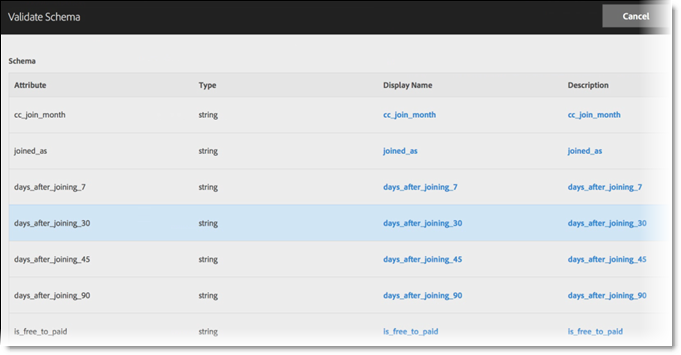

# 驗證結構

驗證程序可讓您將顯示名稱和說明對應至已上傳的屬性 (字串、整數、數字等)。系統會根據這些設定來建立結構。此結構用於驗證將來上傳至此資料來源的所有資料。這個對應程序不會更改原始資料。

>[!NOTE]
>
>在驗證後更新結構會刪除客戶屬性。請參閱[更新結構 (也會刪除屬性)](t-crs-usecase.md)。

**[!UICONTROL 客戶屬性Source]** > **[!UICONTROL 建立新的客戶屬性Source]** > **[!UICONTROL 檢視/編輯結構描述]**

在[!UICONTROL 驗證結構]頁面上，結構的每一列代表上傳之 CSV 檔案的一欄。

* **[!UICONTROL 新增資料：]**&#x200B;可讓您上傳新的屬性資料至此資料來源。

* **[!UICONTROL 檢視/編輯結構：]**&#x200B;將顯示名稱對應至屬性資料，如下一個步驟所述。

* **[!UICONTROL FTP 設定：]**[透過 FTP 上傳資料](t-upload-attributes-ftp.md)。

* **[!UICONTROL ID查閱：]**&#x200B;輸入您`.csv`中的客戶ID (CID)以查閱該ID的Experience Cloud資訊。 在疑難排解訪客的屬性資料為何沒有顯示時，此功能很實用：

   * **[!UICONTROL ECID (Experience Cloud ID)：]**&#x200B;顯示您是否使用最新的 Experience Cloud ID Service。如果您使用MCID服務，但此處並未列出ID，表示Experience Cloud尚未收到該CID的別名。 這表示訪客還沒登入，或您的實作沒有傳遞該 ID。

   * **[!UICONTROL CID （客戶識別碼）：]**&#x200B;與此CID關聯的屬性。 如果您使用 prop 或 eVar 上傳 CID (AVID)，有看到屬性顯示但沒有 AVID，這表示訪客尚未登入您的網路。

   * **[!UICONTROL AVID (Analytics 訪客 ID)：]**&#x200B;顯示您是否使用 prop 或 eVar 上傳 CID。如果這些ID正傳遞至Experience Cloud，則此處會顯示與您輸入的CID相關聯的任何訪客ID。

在Experience Cloud中建立客戶屬性來源和FTP帳戶後，您也可透過FTP上傳資料。 您需為每個屬性來源建立一個 FTP 帳戶。上傳的檔案會儲存在該帳戶的根資料夾中。資料必須是 `.csv` 格式，並另有一個 `.fin` 檔案用以指出上傳完成。

您套用至字串、整數、數字的名稱是用於建立 [!DNL Analytics] 度量。

* 從上傳的`.csv`檔案讀取的&#x200B;**[!UICONTROL 屬性：]**&#x200B;屬性資料。

* **[!UICONTROL 類型：]**&#x200B;資料類型，例如：

   * **字串：**&#x200B;字元順序。

   * **整數：**&#x200B;全數字。

   * **數字：**&#x200B;最多可以有兩位小數。

* **[!UICONTROL 顯示名稱：]**&#x200B;好記的屬性名稱。例如，您可以將屬性&#x200B;*客戶年齡*&#x200B;變更為&#x200B;*客戶自*&#x200B;起。

* **[!UICONTROL 說明：]**&#x200B;好記的屬性說明。
