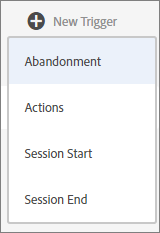
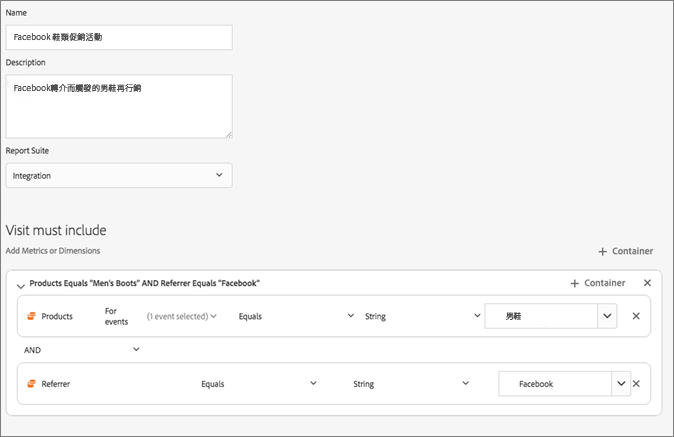

# CX Enterprise Triggers

CX Enterprise中的[!UICONTROL Triggers]可讓您識別、定義及監控重要的客戶行為，然後產生跨應用程式的交流，重新與訪客互動。 您可以在進行即時決策和個人化時使用觸發器。

例如：

* 針對放棄購物車或透過移除產品放棄購物車設定快速再行銷
* 不完整的表單和應用程式
* 網站上的任何動作或動作順序

>[!NOTE]
>
>有關使用[!UICONTROL Triggers]的更多資訊可在[Campaign Standard](https://experienceleague.adobe.com/docs/campaign-standard/using/integrating-with-adobe-cloud/working-with-campaign-and-triggers/using-triggers-in-campaign.html?lang=zh-Hant)中取得。

## 觸發器的型別

一般而言，觸發器可能需要 15 到 90 分鐘的時間來啟動行銷活動。 時間延遲長短取決於資料收集實作、管道上的負載、已定義觸發器的自訂設定，以及 Adobe Campaign 中的工作流程。

* **丟棄：**&#x200B;您可以建立觸發器，在訪客檢視產品但未新增任何項目至購物車時引發。
* **動作：**&#x200B;您可以建立觸發器，在電子報註冊、電子郵件訂閱或信用卡申請 (確認) 等動作後引發。 如果您是零售商，可針對註冊忠誠度計畫的訪客建立觸發器。 若為媒體和娛樂產業，可針對觀看特定節目的訪客建立觸發器，而您可能會想透過意見調查給予回應。
* **工作階段開始和工作階段結束：**&#x200B;針對工作階段開始和工作階段結束事件建立觸發器。

## 建立CX Enterprise觸發程式

建立觸發器並設定觸發器的條件。 例如，您可以指定造訪期間觸發器規則的條件，例如「購物車放棄」等量度，或產品名稱等維度。 符合規則時，觸發器就會執行。

>[!NOTE]
>
>目前存在 100 個觸發器的技術限制。

1. 在CX Enterprise中，按一下，然後按一下&#x200B;**[!UICONTROL Data Collection/Launch]**。
1. 在[!UICONTROL Triggers]卡片上，按一下&#x200B;**[!UICONTROL Manage Triggers]**。
1. 按一下&#x200B;**[!UICONTROL New Trigger]**，然後指定觸發器的型別：

   

1. 完成下列欄位，並將量度與維度項目拖曳至規則的容器來設定觸發器：

   | 元素 | 說明 |
   | --- | --- |
   | [!UICONTROL Name] | 此觸發器的易記名稱。 |
   | [!UICONTROL Description] | 此觸發器的說明、使用方式等資訊。 |
   | [!UICONTROL Report Suite] | 用於此觸發器的 Analytics [報表套裝](https://experienceleague.adobe.com/docs/analytics/admin/manage-report-suites/report-suites-admin.html?lang=zh-Hant)。 此設定可識別要使用的報表資料。 |
   | 造訪必須包括 造訪不得包括 在無動作後觸發 包括中繼資料 | 您可以定義準則或您要發生的訪客行為，以及您不要發生的訪客行為。 例如，簡單的購物車丟棄觸發器的規則可能是：<ul><li>造訪必須包括： [!UICONTROL Cart Addition] （量度）和[!UICONTROL Exists]。 (您可以進一步調整具有特定產品檢視或具有瀏覽器類型之類維度的規則)。</li><li>造訪不得包括： [!UICONTROL Checkout]。</li><li>無動作達下列時間後觸發：10 分鐘。</li><li>[!UICONTROL Include Meta Data]：可讓您新增與訪客的行為相關的特定[!DNL Campaign]維度或變數。 此欄位有助於 Adobe Campaign 建置正確的再行銷電子郵件。</li></ul> 您可以根據您判斷對規則來說很重要的准則，在容器內或容器之間指定[!UICONTROL Any]、[!UICONTROL And]或[!UICONTROL Or]邏輯。 |
   | [!UICONTROL Container] | [!UICONTROL Containers]是您設定並儲存定義觸發器的規則、條件或篩選器的位置。 如果您想讓事件同時發生，請將事件放在相同的容器中。 這表示每個容器是在點擊層級獨立處理。 例如，如果您有兩個以和運算子聯結的容器，您可預期規則在兩個點擊符合要求時符合資格。 |
   | 發生後開始新工作階段 | 為工作階段開始和工作階段結束事件建立觸發器。 |

   {style="table-layout:auto"}

1. 按一下「**[!UICONTROL Save]**」。
1. 在 [!DNL Adobe Campaign] 中使用這些觸發器進行[即時再行銷](https://experienceleague.adobe.com/docs/campaign-standard/using/integrating-with-adobe-cloud/working-with-campaign-and-triggers/about-adobe-experience-cloud-triggers.html?lang=zh-Hant)。

## 範例觸發器

CX Enterprise Triggers範例：

### 購物車放棄觸發器

例如，下列頁面會根據造訪期間檢視的產品，顯示您可用於[!UICONTROL Cart Abandonment]觸發器的規則。

### 反向連結觸發器

當點擊隨「男靴」產品和 Facebook 的反向連結傳入時，便會引發下列觸發器。 為了在同一個點擊中評估這兩個條件 (*產品*&#x200B;和&#x200B;*反向連結*)，應該將它們新增至相同的容器中。

