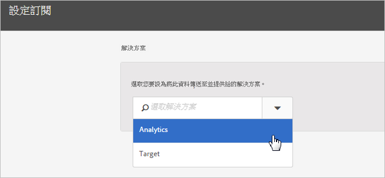

# 如何在 Experience Cloud 中設定訂閱

了解解決方案資料來源和設定訂閱。訂閱可讓客戶屬性資料在 Experience Cloud 和解決方案 ([!DNL Analytics] 和 [!DNL Target]) 之間流動。

例如，Adobe Analytics 訂閱可啟用報表中的屬性資料。若您使用 Adobe Target，則可上傳客戶屬性以便鎖定目標和細分。

**[!UICONTROL 客戶屬性來源]** > **[!UICONTROL 建立新的客戶屬性來源]** > **[!UICONTROL 新增]**

| 元素 | 說明 |
|--- |--- |
| 解決方法 | **Adobe Analytics** &#x200B;選取 Analytics，指定您要用來接收屬性資料的報表套裝，以及要包含的屬性。 **Adobe Target** &#x200B;您可上傳客戶屬性以便鎖定目標和細分。如果想根據屬性資料鎖定測試，或想在 Analytics 中將資料用於分段，這個功能會很好用。 訪客的已上傳客戶屬性資料在登入時即可使用，位於 **[!DNL Target]** > **對象**&#x200B;中。 支援多個資料來源您在網站上[設定客戶 ID](core-services.md) 時，請確定至少有一個別名訂閱了 [!DNL Target]。 |
| 報表套裝 (Analytics) | 來自 Analytics 的報表套裝。 在單一屬性來源的 Analytics 訂閱中，不可加入超過 10 個報表套裝。選擇要包含哪些報表套裝時，請考慮下列建議事項：<ul><li>選擇具有同一組已驗證客戶的報表套裝。如果一個報表套裝中的已驗證客戶與另一個報表套裝中的已驗證客戶沒有重疊，請將這些報表套裝區分至不同的屬性來源中。</li><li>如果可行，屬性來源中包含的報表套裝應具有類似的流量。</li></ul> 如果超過 10 個報表套裝有同一組已驗證客戶，可以設定額外的客戶屬性來源，每個各有最多 10 個報表套裝。 |
| 要包含的屬性 (Analytics 和 [!DNL Target]) | 您要傳送給解決方案的屬性。 設定訂閱與選取屬性時，系統會根據您擁有的解決方案，_針對每個報表套裝_&#x200B;套用以下欄數限制：<ul><li>Foundation：0 個</li><li>Select：3 個</li><li>Prime：15 個</li><li>Ultimate：200 個</li><li>Standard：共 3 個</li><li>Premium：每一報表套裝 200 個</li><li>[!DNL Target] Standard：5 個</li><li>[!DNL Target] Premium：200 個</li></ul> **注意：**&#x200B;升級至 Analytics Premium 後，您必須等待 24 小時才可使用其他屬性。在這段期間，您可能會看到已達到屬性訂閱上限錯誤。 |

{style=&quot;table-layout:auto&quot;}
