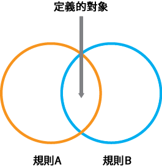
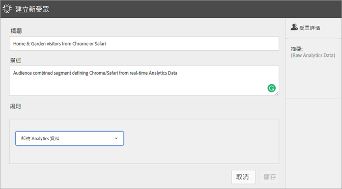

# 建立對象

了解如何使用屬性規則來建立對象與定義 Experience Cloud 中的複合對象。

本文可協助您了解如何：

* 建立對象
* 建立規則
* 使用規則來定義複合對象

下圖代表複合對象中的兩個規則。

每個圓圈代表定義對象成員資格的規則。兩個對象規則均符合成員資格的訪客會重疊，成為複合、已定義的對象。

>[!NOTE]
>
>在指定期間的資料收集完成後，就能完全定義對象。

下列範例說明如何建立複合對象的規則。此對象包括：

* 「家庭與花園」區域衍生自頁面資料或原始分析資料。
* 從[發佈](audience-library.md#task_32FEEFE0B32E4E388CD4D892D727282A)至 [!DNL Experience Cloud] 的 [!DNL Adobe Analytics] 區段衍生出的 Chrome 和 Safari 使用者。

   

**若要建立對象**

1. 在 [!DNL Experience Cloud] 中的 [!DNL Experience Platform] 底下，選取「**[!UICONTROL 人員]** > **[!UICONTROL 對象庫]」。**
1. 在「[!UICONTROL 對象]」頁面上，選取「**[!UICONTROL 新增]**」。 

   

1. 在[!UICONTROL 建立新對象]頁面上，指定標題和說明。
1. 在[!UICONTROL 規則]下，選擇屬性來源：

   * **[!UICONTROL Real-Time Analytics：]**(或原始資料) 這是從即時 Analytics 影像請求衍生的屬性資料，並包含 eVars 和事件等資料。使用此屬性來源時，您必須選取報表套裝，並定義要包含的維度或事件。這個報表套裝選取項目提供了報表套裝所使用的變數結構。
   >[!NOTE]
   >
   >由於快取關係，Experience Cloud 會在 12 小時後才顯示 Analytics 中刪除的報表套裝資訊。

   * **[!UICONTROL Experience Cloud：]**&#x200B;從 [!DNL Experience Cloud] 來源衍生的屬性資料。例如，這可以是您在 [!DNL Analytics] 中建立的對象區段資料，或是 [!DNL Audience Manager] 中的資料。

1. 定義對象規則，然後選取「**[!UICONTROL 儲存]」。**

>[!NOTE]
>
>定義對象規則時，您應該了解您的實作變數。

在[!UICONTROL 規則]底下，定義 *`Home & Garden`* 屬性選取項目：

* **[!UICONTROL 屬性來源：]**&#x200B;原始 Analytics 資料
* **[!UICONTROL 報表套裝：]**&#x200B;報表套裝 31
* 維度 = **[!UICONTROL 商店 (商品) (v6)]** > **[!UICONTROL 等於]** > **[!UICONTROL 家庭與花園]**

*Chrome 和 Safari 訪客*&#x200B;是從 Analytics 共用的對象區段：

* **[!UICONTROL 屬性來源：]** Experience Cloud
* **[!UICONTROL 維度：]** Chrome 與 Safari 訪客

若要比較，您可以新增 *OR* 規則來查看網站區段 (例如露台與家具) 的所有訪客。

產生的規則是已定義的對象，其中包括造訪過「家庭與花園」的 Chrome 與 Safari 使用者。「中庭與家具」區段可深入分析造訪該網站區域的所有訪客。

* **歷史預估：**(虛線圓形) 代表根據 [!DNL Analytics] 資料建立的規則。
* **實際對象：**(實線圓形) 任何已建立且具有來自 Audience Manager 的 30 天資料之規則。Audience Manager 資料達到 30 天時，虛線就會變成實線，並呈現實際數字。

指定時段的資料收集完成後圓圈會結合，顯示已定義的對象。

在儲存對象後，可以將其用於其他應用程式。例如，您可以在 Adobe Target 活動中加入共用對象。
