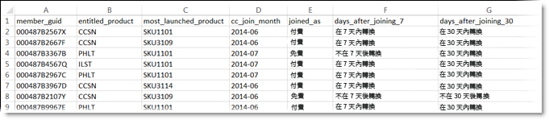
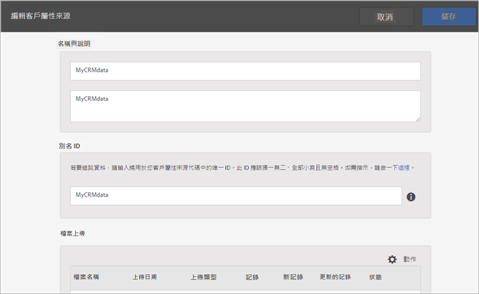
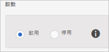

# 建立客戶屬性來源及上傳資料檔案

建立客戶屬性來源 (CSV 和 FIN 檔案) 並上傳資料。您可以在準備就緒後啟動資料來源。資料來源生效後，將屬性資料共用給 Analytics 和 Target。

## 客戶屬性工作流程 {#concept_BF0AF88E9EF841219ED4D10754CD7154}


1. [建立資料檔案](t-crs-usecase.md#task_B5FB8C0649374C7A94C45DCF2878EA1A)
1. [建立屬性來源及上傳資料檔案](t-crs-usecase.md#task_09DAC0F2B76141E491721C1E679AABC8)
1. [驗證結構](t-crs-usecase.md#task_09DAC0F2B76141E491721C1E679AABC8)
1. [設定訂閱並啟用屬性來源](t-crs-usecase.md#task_1ACA21198F0E46A897A320C244DFF6EA)

啟動資料來源後，您可以：

* [在 Adobe Analytics 中使用客戶屬性](t-crs-usecase.md#task_7EB0680540CE4B65911B2C779210915D)
* [在 Adobe Target 中使用客戶屬性](t-crs-usecase.md#task_FC5F9D9059114027B62DB9B1C7D9E257)

>[!IMPORTANT]
>
>若要存取此功能，必須將使用者指派給客戶屬性的產品個人資料 (客戶屬性 - 預設存取)。導覽至&#x200B;**[!UICONTROL 「管理]** > **[!UICONTROL Admin Console]** > **[!UICONTROL 產品」]**。如果&#x200B;*「客戶屬性」*&#x200B;顯示為其中一個[!UICONTROL 產品個人資料]，表示您可以開始使用了。加入客戶屬性群組的使用者可在 Experience Cloud 介面的左側看到「[!UICONTROL 客戶屬性]」功能表。
>
>若要使用客戶屬性功能，使用者也必須加入解決方案層級的群組 (Analytics 或 [!DNL Target])。

請參閱[管理 Experience Cloud 使用者和產品](admin-getting-started.md#task_3295A85536BF48899A1AB40D207E77E9)。

## 建立資料檔案 {#task_B5FB8C0649374C7A94C45DCF2878EA1A}

此資料是來自您 CRM 的企業客戶資料。資料可能包含產品的訂閱者資料，包括成員 ID、已授權產品、最常啟動的產品等。

1. 建立 `.csv`.

   >[!NOTE]
   >
   >在程序後面的步驟中，您需拖放 `.csv` 以上傳檔案。不過，如果您[透過 FTP 上傳](t-upload-attributes-ftp.md#task_591C3B6733424718A62453D2F8ADF73B)，則另外還需要一個與 `.csv` 同名的 `.fin` 檔案。

   企業客戶資料檔案範例：

   

1. 繼續進行之前，請先檢閱[資料檔案需求](crs-data-file.md#concept_DE908F362DF24172BFEF48E1797DAF19)中的重要資訊，然後再上傳檔案。
1. [建立客戶屬性來源及上傳資料檔案](t-crs-usecase.md#task_BCC327B2A0EF4A1BBB2934013AB92B78)，如下所述。

## 建立屬性來源及上傳資料檔案 {#task_09DAC0F2B76141E491721C1E679AABC8}

在 Experience Cloud 的「建立新客戶屬性來源」頁面執行這些步驟。

>[!IMPORTANT]
>
>建立、修改或刪除客戶屬性來源時，大約會有一小時的延遲，之後 ID 就會開始與新資料來源同步。您必須有 Audience Manager 管理權限，才能建立或修改客戶屬性來源。連絡 Audience Manager 客戶服務或洽詢如何取得管理權限。

1. 在[!DNL Experience Cloud]中，選擇菜單表徵圖。
1. 在&#x200B;**[!DNL Experience Platform]**&#x200B;下，選擇&#x200B;**[!UICONTROL People]** > **[!UICONTROL 客戶屬性]**。

   您可以在[!UICONTROL 「客戶屬性」]頁面管理及編輯現有屬性資料來源。

   
1. 選擇&#x200B;**[!UICONTROL 新建]**。

   
1. 在[!UICONTROL 「編輯客戶屬性來源」]頁面，設定以下欄位：

   * **[!UICONTROL 名稱：]**&#x200B;好記的資料屬性來源名稱。若為 [!DNL Adobe Target]，屬性名稱不得包含空格。如果傳遞了包含空格的屬性，[!DNL Target] 會忽略該屬性。其他不支援的字元包括：`< , >, ', "`.

   * **[!UICONTROL 說明：]**(選用) 資料屬性來源的說明。

   * **[!UICONTROL 別名 ID：]**&#x200B;代表客戶屬性資料的來源，如特定 CRM 系統。[!UICONTROL 別名 ID] 是用於客戶屬性來源代碼的唯一 ID。此 ID 應是唯一、小寫、無空格。在 Experience Cloud 中，針對客戶屬性來源在「[!UICONTROL 別名 ID]」欄位中輸入的值，應與從實作傳入的值相符 (不論是透過 Data Collection (Launch)、Dynamic Tag Management 還是 Mobile SDK 的 JavaScript 傳入)。

      別名 ID 會對應於您設定其他客戶 ID 值的特定區域。例如：

      * **Dynamic Tag Management：**&#x200B;別名 ID 對應於 [Experience Cloud ID Service](https://experienceleague.adobe.com/docs/dtm/using/tools/macid.html?lang=zh-Hant) 工具中[!UICONTROL 客戶設定]底下的&#x200B;*整合代碼*&#x200B;值。

      * **訪客 API：**&#x200B;別名 ID 對應於您可與每位訪客建立關聯的其他[客戶 ID](https://experienceleague.adobe.com/docs/id-service/using/reference/authenticated-state.html?lang=zh-Hant)。

         例如，下列位置中的&#x200B;*「crm_id」*：

         ```
         "crm_id":"67312378756723456"
         ```

      * **iOS：**&#x200B;別名 ID 對應於 [visitorSyncIdentifiers:identifiers](https://experienceleague.adobe.com/docs/mobile-services/ios/overview.html?lang=zh-Hant) 中的&#x200B;*「idType」*。

         例如：

         `[ADBMobile visitorSyncIdentifiers:@{@<`**`"idType"`**`:@"idValue"}];`

      * **Android™：** 別名 ID 對應至 [syncIdentifiers](https://experienceleague.adobe.com/docs/mobile-services/android/overview.html?lang=zh-Hant) 中的「*&quot;idType&quot;*」。

         例如：

         `identifiers.put(`**`"idType"`**`, "idValue");`

         請參閱[運用多個資料來源](crs-data-file.md#section_76DEB6001C614F4DB8BCC3E5D05088CB)，以了解別名 ID 欄位和客戶 ID 的資料處理相關資訊。
   * **[!UICONTROL 檔案上傳：]**&#x200B;您可以拖放 `.csv` 資料檔案，或透過 FTP 上傳資料(使用 FTP 還需要 `.fin` 檔案)。請參閱[透過 FTP 上傳資料](t-upload-attributes-ftp.md#task_591C3B6733424718A62453D2F8ADF73B)。

      >[!IMPORTANT]
      >
      >需符合特定的資料檔案需求。如需詳細資訊，請參閱[資料檔案需求](crs-data-file.md#concept_DE908F362DF24172BFEF48E1797DAF19)。


      上傳檔案後，表格資料會顯示在此頁面上的[!UICONTROL 檔案上傳]標題底下。您可以驗證結構、設定訂閱或設定 FTP。

      **檔案上傳圖**

      

   * **[!UICONTROL 唯一客戶 ID：]**&#x200B;顯示您上傳多少個唯一 ID 至此屬性來源。

   * **[!UICONTROL 已將別名傳送至 Experience Cloud 訪客 ID 之客戶提供的 ID：]**&#x200B;顯示有多少個 ID 已將別名傳送至 Experience Cloud 訪客 ID。

   * **[!UICONTROL 具有高別名數之客戶提供的 ID：]**&#x200B;顯示已將 500 個或更多別名傳送至 Experience Cloud 訪客 ID 之客戶提供的 ID 數。這些客戶提供的 ID 很可能不代表個人，而代表某種共用登入名稱。系統會將與這些 ID 相關的屬性分配給最近設定別名的 500 個 Experience Cloud 訪客 ID，直到別名數達到 10,000 個。到時候，系統會令客戶提供的 ID 失效，並不再發送關聯的屬性。


## 驗證結構 {#task_404AAC411B0D4E129AB3AC8B7BE85859}

驗證程序可讓您將顯示名稱和說明對應至已上傳的屬性 (字串、整數、數字等)。您也可以更新結構以刪除屬性。

請參閱[驗證結構](validate-schema.md#concept_B3A01A15D04E4F998118E09B3A9B5043)。

若要刪除屬性，請參閱 [(選用) 更新結構 (刪除屬性)](t-crs-usecase.md#task_6568898BB7C44A42ABFB86532B89063C)。

## (選用) 更新結構 (刪除屬性) {#task_6568898BB7C44A42ABFB86532B89063C}

如何在結構中刪除屬性及取代屬性。

1. 在[!UICONTROL 編輯客戶屬性來源]頁面上，移除 **[!UICONTROL Target]** 或 **[!UICONTROL Analytics]** 訂閱 (位於[!UICONTROL 設定訂閱]底下)。
1. [上傳含有更新欄位的新資料檔案](t-crs-usecase.md#task_09DAC0F2B76141E491721C1E679AABC8)。

## 設定訂閱及啟動屬性來源 {#task_1ACA21198F0E46A897A320C244DFF6EA}

設定訂閱可設定 Experience Cloud 和解決方案之間的資料流。啟動屬性來源可讓資料流向已訂閱的解決方案。您上傳的客戶記錄會與您網站或應用程式傳入的 ID 訊號相符。

請參閱[設定訂閱](subscription.md#concept_ECA3C44FA6D540C89CC04BA3C49E63BF)。

**啟動屬性來源**

在[!UICONTROL 新建[或編輯]客戶屬性源]頁面上，找到[!UICONTROL 激活]標題，然後選擇&#x200B;**[!UICONTROL 活動]**。



## 在 Adobe Analytics 中使用客戶屬性 {#task_7EB0680540CE4B65911B2C779210915D}

有了 Adobe Analytics 等解決方案所提供的資料，您就可以彙整資料報表、分析資料，並在行銷活動中採取適當的行動。

以下範例示範以上傳屬性為依據的 [!DNL Analytics] 區隔。此區段顯示最常啟動 Photoshop 產品的 [!DNL Photoshop Lightroom] 訂閱者。


您在 Experience Cloud 發佈區段後，Experience Cloud Audiences 和 Audience Manager 可隨即使用該區段。

## 在 Adobe Target 中使用客戶屬性 {#task_FC5F9D9059114027B62DB9B1C7D9E257}

在 [!DNL Target] 中，您可在建立對象時，從[!UICONTROL 訪客資料]區段選取客戶屬性。清單中的所有客戶屬性都會具備字首 `crs.`。您可視需求將這些屬性與其他資料屬性結合，以建立對象。


請參閱 [!DNL Target] 說明中的[建立新對象](https://experienceleague.adobe.com/docs/target/using/audiences/create-audiences/audiences.html?lang=zh-Hant)。
