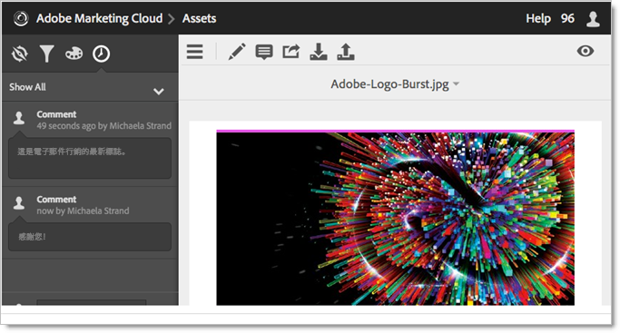

# 共用 Experience Cloud 資產資料夾

與 Creative Cloud 使用者共用 Experience Cloud 資產資料夾。

1. 在資產資料夾中，選取「**[!UICONTROL 分享到 Creative Cloud]**」。

   
1. 在「分享到 Creative Cloud」頁面上，搜尋該使用者，然後選取「**[!UICONTROL 新增]**」。

   

1. 選取「**[!UICONTROL 分享]**」。
1. 啟動 [!DNL Creative Cloud] 桌面 (或在瀏覽器中導覽至「[!UICONTROL Creative Cloud Files]」頁面)，然後尋找請求通知。

   
1. 開啟請求，然後選取「**[!UICONTROL 接受]**」。

   
1. 若要存取資料夾內容，請選取「**[!UICONTROL 開啟資料夾]**」(或「**[!UICONTROL 在網頁上檢視]**」)。

   
1. 繼續操作，在共用資產上新增註解：

   在 Creative Cloud 中，您可以選取影像，然後選取「**[!UICONTROL 活動]**」，在影像上新增註解。 註解會同步至 [!DNL Creative Cloud] 和 [!DNL Experience Cloud] 中的資產。

   

   在 Experience Cloud 中選取影像，然後選取時間軸圖示，在影像上新增註解。 註解會同步到 Creative Cloud 和 Experience Cloud 中的資產。

   

1. 若要取消共用資料夾，請選取「**[!UICONTROL 使用 Creative Cloud 共用]**」(類似於[步驟 3](t-share-creative-cloud.md#step_BA17CFA185284641A9B878BA29551996))，然後選取 X 來移除使用者，再選取「**[!UICONTROL 共用]**」。

移除所有 Creative Cloud 使用者後，資料夾便不再共用，Creative Cloud 使用者也不能再存取資料夾。

更多使用共用資產的方法包括：

* 在 [!UICONTROL  的]「資產選取器」[!DNL Adobe Social]中使用資產以用於社交貼文。
* 在 [!DNL Adobe Target] 中，為活動內的影像載入或調換[優惠方案庫](https://experienceleague.adobe.com/docs/target/using/experiences/offers/manage-content.html?lang=zh-Hant)裡的資產。

系統會在與 Creative Cloud 共用的資料夾上顯示 Creative Cloud 標誌。

相關說明：

* [Creative Cloud 說明 - 管理和同步檔案](https://helpx.adobe.com/tw/creative-cloud/help/sync-creative-cloud-files.html)
* [Creative Cloud 說明 - 與他人共同作業](https://helpx.adobe.com/tw/creative-cloud/help/collaboration.html)
* [Creative Cloud 說明 - 共同作業常見問題集](https://helpx.adobe.com/tw/creative-cloud/help/collaboration-faq.html)
