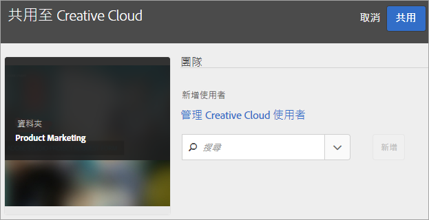

# 共用 Experience Cloud 資產資料夾

與 Creative Cloud 使用者共用 Experience Cloud 資產資料夾。

1. 在「資產」資料夾中，選取「共用至Creative Cloud」]**。**[!UICONTROL 

   
1. 在「共用到Creative Cloud」頁上，搜索用戶，然後選擇&#x200B;**[!UICONTROL 添加]**。

   

1. 選擇&#x200B;**[!UICONTROL 共用]**。
1. 啟動 [!DNL Creative Cloud] 桌面 (或在瀏覽器中導覽至 [!UICONTROL Creative Cloud「檔案」]頁面)，然後尋找要求通知。

   
1. 開啟請求，然後選擇&#x200B;**[!UICONTROL Accept]**。

   
1. 要訪問資料夾內容，請選擇&#x200B;**[!UICONTROL 開啟資料夾]**（或&#x200B;**[!UICONTROL 在Web上查看]**）。

   
1. 繼續操作，在共用資產上新增註解：

   在「Creative Cloud」中，您可以選取影像，然後選取&#x200B;**[!UICONTROL Activity]**&#x200B;以在影像上新增註解。 註解會同步至 [!DNL Creative Cloud] 和 [!DNL Experience Cloud] 中的資產。

   

   在Experience Cloud中，選取影像中，然後選取時間線圖示以在影像上新增註解。 註解會同步到 Creative Cloud 和 Experience Cloud 中的資產。

   

1. 若要取消共用資料夾，請選取「使用Creative Cloud共用」]**（類似於[步驟3](t-share-creative-cloud.md#step_BA17CFA185284641A9B878BA29551996)），然後選取「X」來移除使用者，然後選取「**[!UICONTROL &#x200B;共用&#x200B;]**」。**[!UICONTROL 

移除所有 Creative Cloud 使用者後，資料夾便不再共用，Creative Cloud 使用者也不能再存取資料夾。

更多使用共用資產的方法包括：

* 在 [!UICONTROL  的]「資產選取器」[!DNL Adobe Social]中使用資產以用於社交貼文。
* 在 [!DNL Adobe Target] 中，為活動內的影像載入或調換[優惠方案庫](https://experienceleague.adobe.com/docs/target/using/experiences/offers/manage-content.html?lang=zh-Hant)裡的資產。

系統會在與 Creative Cloud 共用的資料夾上顯示 Creative Cloud 標誌。

相關說明：

* [Creative Cloud 說明 - 管理和同步檔案](https://helpx.adobe.com/tw/creative-cloud/help/sync-creative-cloud-files.html)
* [Creative Cloud 說明 - 與他人共同作業](https://helpx.adobe.com/tw/creative-cloud/help/collaboration.html)
* [Creative Cloud 說明 - 共同作業常見問題集](https://helpx.adobe.com/tw/creative-cloud/help/collaboration-faq.html)
