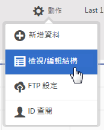
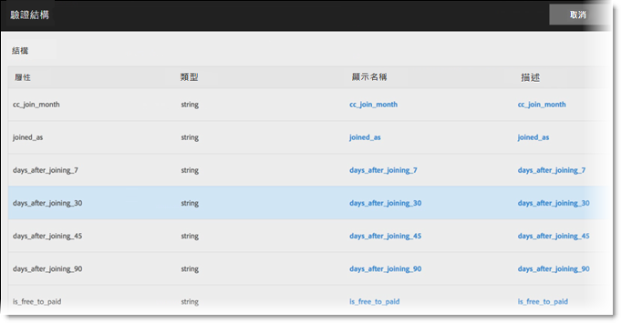

# 驗證結構

驗證程序可讓您將顯示名稱和說明對應至已上傳的屬性 (字串、整數、數字等)。系統會根據這些設定來建立結構。此結構用於驗證將來上傳至此資料來源的所有資料。映射過程不會更改原始資料。

>[!NOTE]
>
>在驗證後更新結構會刪除客戶屬性。請參閱[更新結構 (也會刪除屬性)](t-crs-usecase.md#task_6568898BB7C44A42ABFB86532B89063C)。

**[!UICONTROL 客戶屬性來源]** > **[!UICONTROL 建立新的客戶屬性來源]** > **[!UICONTROL 檢視/編輯結構]**

在[!UICONTROL 「驗證結構」]頁面，結構的每一列代表上傳之 CSV 檔案的一欄。

* **[!UICONTROL 新增資料：]**&#x200B;可讓您上傳新的屬性資料至此資料來源。

* **[!UICONTROL 檢視/編輯結構：]**&#x200B;將顯示名稱對應至屬性資料，如下一個步驟所述。

* **[!UICONTROL FTP 設定：]**[透過 FTP 上傳資料](t-upload-attributes-ftp.md#task_591C3B6733424718A62453D2F8ADF73B)。

* **[!UICONTROL ID 查閱：]**&#x200B;輸入您的 `.csv` 中的客戶 ID (CID) 以查閱該 ID 的 Experience Cloud 資訊。在疑難排解訪客的屬性資料為何沒有顯示時，此功能很實用：

   * **[!UICONTROL ECID (Experience Cloud ID)：]**&#x200B;顯示您是否使用最新的 Experience Cloud ID Service。如果您在 MCID 服務上但此處沒有列出 ID，表示 Experience Cloud 尚未收到該 CID 的別名。這表示訪客還沒登入，或您的實作沒有傳遞該 ID。

   * **[!UICONTROL CID (客戶 ID)：]**&#x200B;與此 CID 關聯的屬性。如果您使用 prop 或 eVar 上傳 CID (AVID)，有看到屬性顯示但沒有 AVID，這表示訪客尚未登入您的網路。

   * **[!UICONTROL AVID (Analytics 訪客 ID)：]**&#x200B;顯示您是否使用 prop 或 eVar 上傳 CID。如果這些 ID 正傳遞至 Experience Cloud，則此處會顯示與您輸入的 CID 相關聯的所有訪客 ID。

在 Experience Cloud 中建立客戶屬性來源和 FTP 帳戶後，您也可透過 FTP 上傳資料。您需為每個屬性來源建立一個 FTP 帳戶。上傳的檔案會儲存在該帳戶的根資料夾中。資料必須為`.csv`格式，並附上第二個`.fin`檔案以指出上傳完成。

您套用至字串、整數、數字的名稱是用於建立 [!DNL Analytics] 度量。

* **[!UICONTROL 屬性：]**&#x200B;從上傳的 `.csv` 檔案讀取的屬性資料。

* **[!UICONTROL 類型：]**&#x200B;資料類型，例如：

   * **字串：**&#x200B;字元順序。

   * **整數：**&#x200B;全數字。

   * **數字：**&#x200B;最多可以有兩位小數。

* **[!UICONTROL 顯示名稱：]**&#x200B;好記的屬性名稱。例如，您可以將屬性&#x200B;*客戶年齡*&#x200B;變更為&#x200B;*客戶自*。

* **[!UICONTROL 說明：]**&#x200B;好記的屬性說明。
